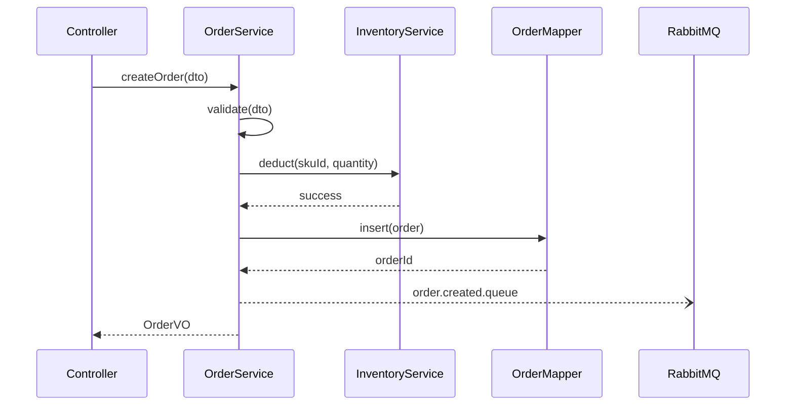
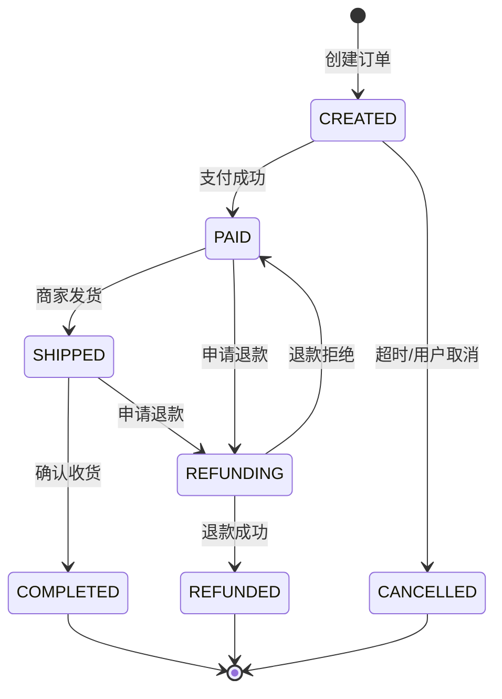
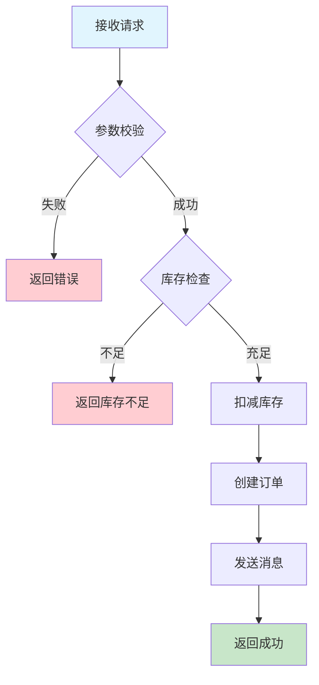
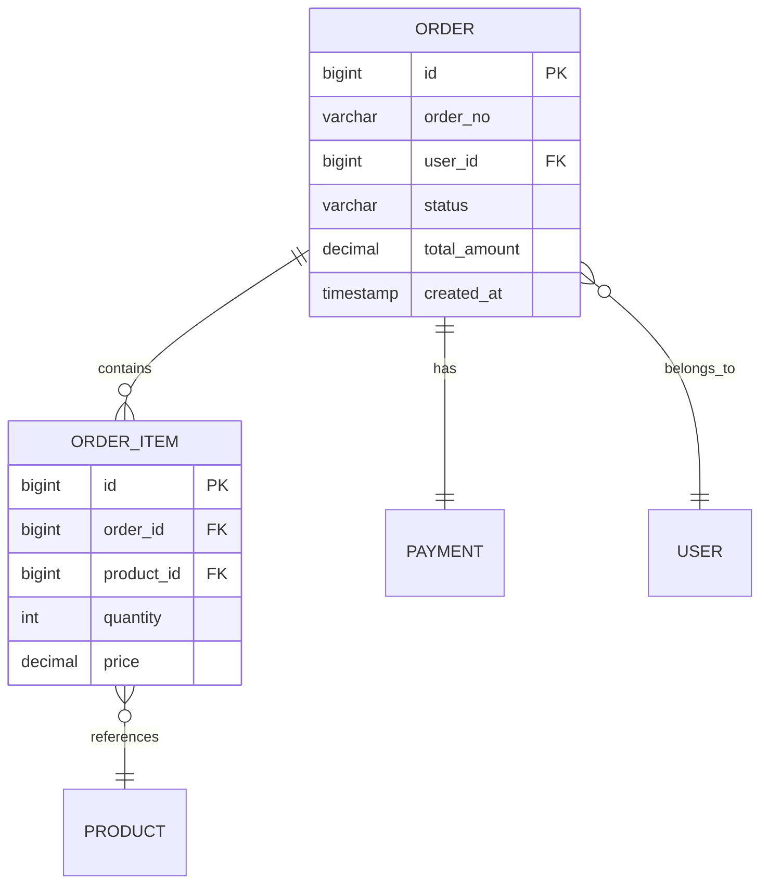
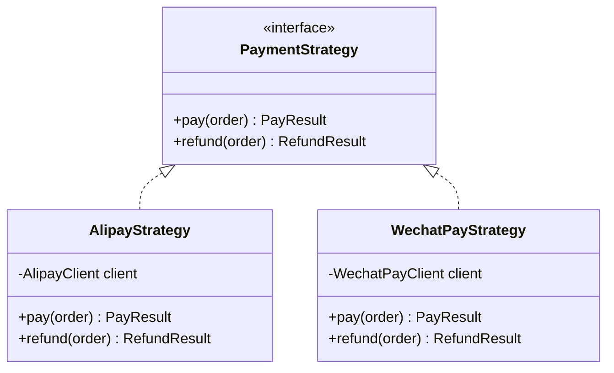

# 输出模板

## 可视化图表指南

### 推荐使用场景

| 图表类型 | 适用场景 | 优先级 |
|----------|----------|--------|
| ASCII 调用链树 | 方法调用关系 | ⭐⭐⭐ 必选 |
| Mermaid 序列图 | 多服务交互、时序逻辑 | ⭐⭐⭐ 强烈推荐 |
| Mermaid 状态图 | 状态机、生命周期 | ⭐⭐⭐ 强烈推荐 |
| Mermaid 流程图 | 业务流程、决策分支 | ⭐⭐ 推荐 |
| 包结构树 | 模块关系、目录结构 | ⭐⭐ 推荐 |
| Mermaid ER图 | 数据模型关系 | ⭐ 可选 |
| Mermaid 类图 | 类继承/实现关系 | ⭐ 可选 |

---

## Mermaid 图表模板

### 序列图（服务交互）

```markdown
## 服务交互时序


```

### 状态图（生命周期）

```markdown
## 订单状态流转


```

### 流程图（业务逻辑）

```markdown
## 订单创建流程


```

### ER 图（数据模型）

```markdown
## 订单相关数据模型


```

### 类图（继承/实现关系）

```markdown
## 支付策略类结构


```

---

## 包结构树模板

### 模块级结构

```markdown
## 项目结构

```
order-service/
├── order-api/                    # API 模块（对外接口定义）
│   └── src/main/java/
│       └── com.example.order.api/
│           ├── dto/              # 数据传输对象
│           ├── enums/            # 枚举定义
│           └── facade/           # Dubbo 接口
│
├── order-service/                # 服务实现模块
│   └── src/main/java/
│       └── com.example.order/
│           ├── controller/       # HTTP 入口
│           ├── service/          # 业务逻辑
│           │   ├── impl/
│           │   └── strategy/     # 策略模式
│           ├── mapper/           # 数据访问
│           ├── domain/           # 领域模型
│           │   ├── entity/
│           │   └── event/
│           ├── integration/      # 外部服务调用
│           │   ├── payment/
│           │   └── inventory/
│           └── job/              # 定时任务
│
└── order-infrastructure/         # 基础设施模块
    └── src/main/java/
        └── com.example.order.infra/
            ├── config/           # 配置类
            ├── mq/               # 消息队列
            └── cache/            # 缓存
```
```

### 关注区域标注

```markdown
## 相关代码结构

```
com.example.order/
├── controller/
│   └── OrderController.java      ← [入口] HTTP 请求处理
├── service/
│   ├── OrderService.java         ← [核心] 业务编排
│   ├── impl/
│   │   └── OrderServiceImpl.java ← [实现] 具体逻辑
│   └── strategy/
│       ├── PriceStrategy.java    ← [策略] 价格计算
│       └── DiscountStrategy.java
├── mapper/
│   ├── OrderMapper.java          ← [数据] MyBatis 接口
│   └── OrderMapper.xml           ← [SQL] 具体 SQL
└── domain/
    ├── entity/
    │   └── Order.java            ← [实体] 订单模型
    └── event/
        └── OrderCreatedEvent.java ← [事件] 领域事件
```
```

---

## 调查范围声明模板

### 基本格式

```markdown
## 调查范围

基于以下范围的分析：

### 已读取文件
- `src/main/java/com/example/service/OrderService.java`
- `src/main/java/com/example/mapper/OrderMapper.java`
- `src/main/resources/mapper/OrderMapper.xml`

### 已分析调用链
1. OrderController.createOrder → OrderService.create → OrderMapper.insert
2. OrderController.getOrder → OrderService.getById → OrderMapper.selectById

### 未覆盖区域
- 异步通知逻辑（MessageService）— 非主流程
- 缓存逻辑（CacheManager）— 未涉及查询问题
```

### 简化格式（快速分析）

```markdown
## 调查范围

基于 3 个文件的快速分析：OrderService.java, OrderMapper.java, OrderMapper.xml

未深入追踪：异步处理、缓存逻辑
```

## 确定性层级模板

### 完整格式

```markdown
## 确定性层级

### ✓ 已确认（代码明确表达）

| 事实 | 证据位置 |
|------|----------|
| 订单创建后状态为 CREATED | OrderService.java:45 `order.setStatus(OrderStatus.CREATED)` |
| 支付成功后更新状态为 PAID | PaymentCallback.java:78 |

### ⚠ 推断（基于代码模式）

| 推断 | 依据 |
|------|------|
| 订单超时后会自动取消 | 存在 OrderTimeoutJob 定时任务，查询 CREATED 状态超过30分钟的订单 |
| 退款会触发库存回补 | RefundService 中调用了 InventoryService.restore 方法 |

### ? 待验证（需要进一步确认）

| 假设 | 验证方式 |
|------|----------|
| 并发下单是否有库存超卖风险 | 检查库存扣减是否使用分布式锁或数据库乐观锁 |
| 消息发送失败是否有重试机制 | 检查 MQ 配置或业务代码中的重试逻辑 |
```

### 简化格式

```markdown
## 确定性层级

**已确认**：
- 订单创建后状态为 CREATED（OrderService.java:45）
- 支付回调会更新订单状态（PaymentCallback.java:78）

**推断**：
- 订单超时会自动取消（基于 OrderTimeoutJob 的存在）

**待验证**：
- 并发下单的库存安全性（需检查锁机制）
```

## 调用链记录模板

### ASCII 树形式

```markdown
## 调用链

```
OrderController.createOrder (controller/OrderController.java:42)
├─→ OrderService.create (service/OrderService.java:56)
│   ├─→ OrderValidator.validate (validator/OrderValidator.java:23)
│   ├─→ InventoryService.deduct (service/InventoryService.java:78)
│   │   └─→ InventoryMapper.updateStock (mapper/InventoryMapper.java:34)
│   ├─→ OrderMapper.insert (mapper/OrderMapper.java:12)
│   └─→ MessageService.sendOrderCreated (service/MessageService.java:45)
│       └─→ [异步] RabbitMQ: order.created.queue
└─→ OrderVO.from (vo/OrderVO.java:18)
```
```

### 表格形式

```markdown
## 调用链

| 层级 | 方法 | 位置 | 职责 |
|------|------|------|------|
| 1 | OrderController.createOrder | controller/OrderController.java:42 | 接收请求，返回响应 |
| 2 | OrderService.create | service/OrderService.java:56 | 业务编排 |
| 3 | OrderValidator.validate | validator/OrderValidator.java:23 | 参数校验 |
| 3 | InventoryService.deduct | service/InventoryService.java:78 | 扣减库存 |
| 4 | InventoryMapper.updateStock | mapper/InventoryMapper.java:34 | 数据库更新 |
| 3 | OrderMapper.insert | mapper/OrderMapper.java:12 | 插入订单 |
| 3 | MessageService.sendOrderCreated | service/MessageService.java:45 | 发送消息 |
```

## 数据流记录模板

```markdown
## 数据流

### OrderDTO → Order 转换

```
CreateOrderDTO (Controller 接收)
  │
  ├─ userId: Long
  ├─ items: List<OrderItemDTO>
  └─ addressId: Long
        │
        ▼ OrderService.create 转换
        │
Order (Entity)
  │
  ├─ id: Long (自动生成)
  ├─ userId: Long (复制)
  ├─ status: OrderStatus.CREATED (设置)
  ├─ items: List<OrderItem> (转换)
  └─ address: Address (查询填充)
        │
        ▼ OrderMapper.insert 持久化
        │
        ▼ OrderVO.from 转换
        │
OrderVO (返回给前端)
  │
  ├─ id: Long
  ├─ orderNo: String
  ├─ status: String
  └─ totalAmount: BigDecimal
```

### 状态变更

| 位置 | 变更 | 触发条件 |
|------|------|----------|
| OrderService.create:67 | null → CREATED | 创建订单 |
| PaymentCallback.handle:34 | CREATED → PAID | 支付成功回调 |
| OrderTimeoutJob.process:45 | CREATED → CANCELLED | 超时30分钟 |
| RefundService.refund:78 | PAID → REFUNDING | 发起退款 |
```

## Git 演进记录模板

```markdown
## Git 演进发现

### 文件：OrderService.java

**发现**：第 123 行注释 `// 兼容旧版本，保留原有逻辑`

**历史**：
```
git log --oneline -5 -- src/main/java/com/example/service/OrderService.java

a1b2c3d 2024-01-15 fix: 修复订单创建并发问题
d4e5f6g 2023-12-20 feat: 支持批量创建订单
h7i8j9k 2023-11-01 refactor: 订单服务重构
```

**关键变更**（a1b2c3d）：
- 添加分布式锁防止库存超卖
- 重试逻辑从 3 次改为 5 次

**启示**：该区域曾有并发问题，修改时需注意锁的使用
```

## 术语记录模板

```markdown
## 术语表

### 已记录术语

| 术语 | 定义 | 引用来源 |
|------|------|----------|
| 账期 | 账单的计费周期，通常为自然月 | glossary.md |
| 冲正 | 交易的逆向操作，用于撤销原交易 | glossary.md |

### 待确认术语

| 术语 | 推测定义 | 发现位置 |
|------|----------|----------|
| 调账 | 手动调整账户余额（基于方法名推测）| AdjustService.java:34 |
| 对账 | 核对交易记录一致性（基于类名推测）| ReconcileJob.java:12 |

建议调用 `/glossary-manager` 添加以上术语。
```
