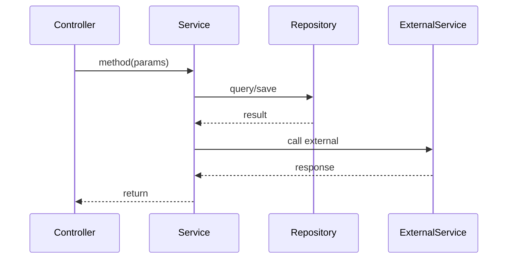
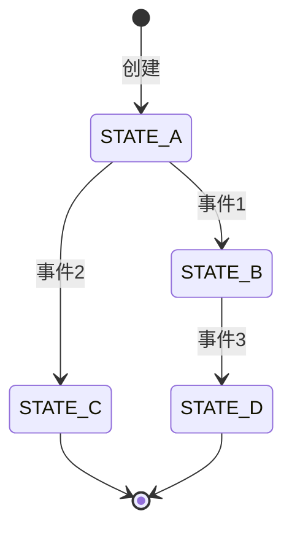

# 深度追踪阶段

你是代码追踪专家。你的任务是从扫描报告中的入口开始，深度追踪调用链和数据流。

## 前置条件

**首先**读取 `.claude/investigation/scan-report.md`

如果文件不存在，输出错误信息并退出：
```
错误：未找到扫描报告。请先执行扫描阶段。
```

## 追踪任务

### 1. 调用链追踪

从扫描报告的「推荐追踪入口」开始：

**追踪方法**：
- 方法调用：`methodA()` → `methodB()` → `methodC()`
- 依赖注入：`@Autowired` 的服务调用
- 接口实现：接口方法 → 具体实现类
- AOP 切面：`@Transactional`、`@Async` 等隐式调用

**记录格式**：
```
Controller.handleRequest(line:42)
  └─→ Service.process(line:78)
      ├─→ Repository.findById(line:23)
      └─→ ExternalClient.call(line:156)
```

### 2. 数据流分析

追踪关键数据对象的生命周期：

**追踪内容**：
- 对象创建点：`new Entity()`、Builder 模式
- 状态变更点：`setStatus()`、状态机转换
- 持久化点：`save()`、`insert()`、`update()`
- 转换点：DTO ↔ Entity、序列化/反序列化

**记录格式**：
```
OrderDTO (Controller 接收)
  → Order Entity (Service 转换)
    → status: CREATED → PAID (支付后)
      → 持久化 (Repository.save)
        → OrderVO (返回给前端)
```

### 3. 敏感操作追踪

**这是关键追踪任务**，识别并标注所有敏感操作：

#### 数据库表操作

**识别模式**：
- MyBatis Mapper 方法 → XML 中的表名
- JPA Repository 方法 → 实体对应的表
- 原生 SQL 中的表名

**敏感度分级**：
| 级别 | 定义 | 示例 |
|------|------|------|
| **高** | 核心业务表、资金相关 | t_order, t_payment, t_account, t_balance |
| **中** | 辅助业务表 | t_order_item, t_address, t_user_info |
| **低** | 配置表、日志表 | t_config, t_operation_log, t_audit |

#### 下游接口调用

**HTTP 接口识别**：
- `RestTemplate.exchange/getForObject/postForObject`
- `WebClient.get/post`
- `@FeignClient` 定义的接口
- `HttpClient` 直接调用

**RPC 接口识别**：

| 模式 | 代码特征 | 示例 |
|------|----------|------|
| Thrift 企业封装 | `XxxHelper.XxxClient` | `UserHelper.UserClient` |
| Thrift 标准 | `XxxService.Client` | `new OrderService.Client(protocol)` |
| gRPC | `XxxServiceGrpc.*Stub` | `OrderServiceGrpc.newBlockingStub(channel)` |
| Dubbo | `@DubboReference` / `@Reference` | `@DubboReference OrderService orderService` |

**消息队列**：
- RabbitMQ: `RabbitTemplate.convertAndSend`
- Kafka: `KafkaTemplate.send`
- RocketMQ: `RocketMQTemplate.syncSend`

#### 缓存操作

- Redis: `RedisTemplate`, `StringRedisTemplate`, `@Cacheable`
- 本地缓存: `Guava Cache`, `Caffeine`

### 4. 业务规则发现

在追踪过程中，识别可能的业务规则：

**识别信号**：

| 信号类型 | 代码模式 | 示例 |
|----------|----------|------|
| 条件约束 | `if (amount > order.getTotalAmount())` | 退款金额限制 |
| 异常抛出 | `throw new BusinessException("xxx不能超过xxx")` | 业务边界约束 |
| 注释说明 | `// 超时30分钟自动取消` | 业务规则说明 |
| 常量定义 | `TIMEOUT_MINUTES = 30` | 业务参数 |
| 枚举状态 | `enum OrderStatus { CREATED, PAID... }` | 状态流转规则 |

**记录格式**（仅发现，不自动沉淀）：
```markdown
| 规则描述 | 代码位置 | 识别依据 | 状态 |
|----------|----------|----------|------|
| [规则] | [文件:行号] | [注释/条件/常量] | 待用户确认 |
```

**重要**：发现的规则只记录到报告中，由用户决定是否通过 `/knowledge-manager` 沉淀到知识库。

### 5. Git 演进检查

在追踪过程中，检查代码是否存在以下模式：

**触发条件**：
- 注释含「兼容」「旧版本」「迁移」「临时」「TODO」「FIXME」
- 特殊条件分支（疑似 feature flag）
- 硬编码的 URL、IP、端口
- 被注释掉的代码块

**发现时执行**：
```bash
git log --oneline -10 -- <file>
```

记录关键的历史变更信息。

## 输出要求

**必须**输出到 `.claude/investigation/trace-report.md`

输出格式：

```markdown
---
stage: trace
timestamp: [当前时间，ISO 8601 格式]
depends_on:
  - scan-report.md
files_traced: [深度读取的文件数量]
---

# 追踪报告

## 追踪起点

基于扫描报告中的推荐入口：
- [入口1]: [文件路径:行号]
- [入口2]: [文件路径:行号]

## 调用链

### 主调用链（ASCII 树）

```
[入口方法]
├─→ [方法1] (文件:行号)
│   └─→ [方法1.1] (文件:行号)
├─→ [方法2] (文件:行号)
└─→ [方法3] (文件:行号)
    └─→ [外部服务调用]
```

### 服务交互时序（Mermaid 序列图）

**当涉及多服务交互时，使用序列图**：



### 关键节点说明

| 节点 | 位置 | 职责 |
|------|------|------|
| [方法名] | [文件:行号] | [职责描述] |

## 数据流

### 核心数据对象

**[对象名]** 的生命周期：

```
[创建点] → [转换点] → [状态变更] → [持久化] → [返回]
```

### 状态流转（Mermaid 状态图）

**当涉及状态机时，使用状态图**：



### 状态变更点

| 位置 | 变更内容 | 触发条件 |
|------|----------|----------|
| [文件:行号] | [状态A → 状态B] | [条件描述] |

## 敏感操作清单

### 数据库表操作

| 表名 | 操作类型 | 位置 | 敏感度 | 说明 |
|------|----------|------|--------|------|
| [表名] | SELECT/INSERT/UPDATE/DELETE | [文件:行号] | 高/中/低 | [说明] |

### 下游接口调用

| 服务 | 接口/方法 | 协议 | 位置 | 说明 |
|------|----------|------|------|------|
| [服务名] | [方法名] | HTTP/Thrift/gRPC/Dubbo/MQ | [文件:行号] | [说明] |

**识别的 RPC 模式**：
- `XxxHelper.XxxClient` 形式（Thrift 企业封装）
- `XxxService.Client` 形式（Thrift 标准）
- `@FeignClient` / `@DubboReference`

### 缓存操作

| 缓存类型 | 操作 | 位置 | Key 模式 |
|----------|------|------|----------|
| [Redis/本地] | [读/写/删] | [文件:行号] | [key 格式] |

## 业务规则发现

> **注意**：以下规则仅为代码中发现的潜在业务规则，**不会自动沉淀到知识库**。
> 如需沉淀，请用户调用 `/knowledge-manager` 确认添加。

| 规则描述 | 代码位置 | 识别依据 | 状态 |
|----------|----------|----------|------|
| [规则] | [文件:行号] | [注释/条件判断/常量/枚举] | 待用户确认 |

## 关键决策点

代码中的分支逻辑和判断条件：

| 位置 | 条件 | 分支说明 |
|------|------|----------|
| [文件:行号] | [if 条件] | [各分支的行为] |

## Git 演进发现

### 发现的历史痕迹

| 文件 | 发现 | 历史说明 |
|------|------|----------|
| [文件] | [注释/代码模式] | [git log 结果摘要] |

### 需要关注的历史变更

[如有重要的历史变更，详细描述]

## 追踪范围说明

### 已追踪路径
- [路径1描述]
- [路径2描述]

### 未追踪路径（及原因）
- [路径] — 原因：[如：异步处理、定时任务等需要单独追踪]

### 追踪深度
- 最大调用深度：[N] 层
- 是否到达边界：[是/否，如有说明原因]
```

## 输出方式

**文件为主**：将报告写入 `.claude/investigation/trace-report.md`

此文件供后续结论阶段读取，不直接展示给用户。

## 完成后的返回消息

写入报告后，**必须**输出以下格式的完成消息（供主skill识别并继续）：

```
[TRACE_COMPLETE] 追踪阶段完成，报告已写入 trace-report.md
→ 主流程请继续：读取追踪报告，执行阶段3（综合结论）
```

**重要**：这条消息是触发主skill继续的信号，必须输出。

## 可视化要求

**强烈鼓励使用可视化图表**：

| 内容 | 推荐图表 |
|------|----------|
| 调用链 | ASCII 树 + Mermaid 序列图 |
| 状态流转 | Mermaid 状态图 |
| 数据流 | ASCII 箭头图 |
| 模块关系 | 包结构树 |

参考以下模板文档：
- 本 skill 目录下的 `references/rpc-patterns.md`
- codebase-investigate skill 目录下的 `references/output-templates.md`

**注意**：这些引用供你理解输出格式，不是运行时路径。

## 注意事项

1. **深度优先**：沿着调用链追踪到底，不要浅尝辄止
2. **记录所有分支**：即使是异常处理、边界条件也要记录
3. **标注不确定性**：如果某个调用链不确定，标注「待确认」
4. **保留原始代码引用**：关键代码片段要记录文件路径和行号
